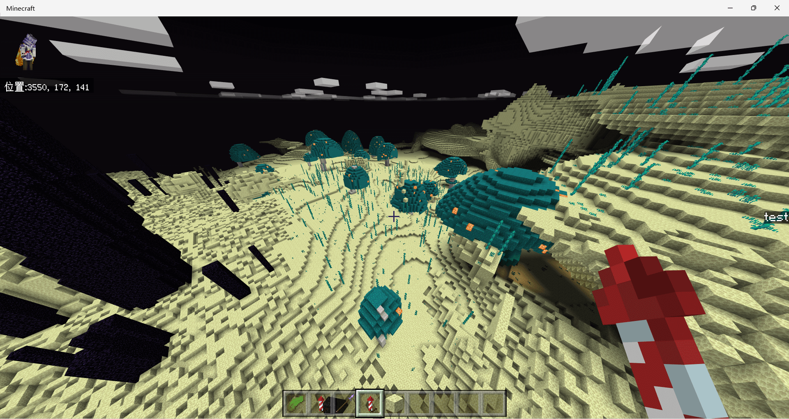

# terra config  

## What is Terra?  
Terra is a third-party open-source terrain generator, available at [GitHub](https://github.com/PolyhedralDev/Terra). PNX integrates Terra as a solution to server terrain generation, allowing you to use Terra in PNX to create epic level.

## Terra Start  
To apply Terra to your world, you need to follow these two steps:
In `server.properties`, set:
```properties
use-terra=on
```
Create a folder in the `worlds` directory, for example, `world/`, and create the following configuration file `config.json`.
```json
{
  "format": "leveldb",
  "generators": {
    "0": {
      "name": "terra",
      "seed": 0,
      "dimensionData": {
        "dimensionName": "minecraft:overworld",
        "dimensionId": 0,
        "minHeight": -64,
        "maxHeight": 319,
        "height": 384,
        "chunkSectionCount": 24
      },
      "preset": {
        "pack": "overworld"
      }
    }
  }
}
```
The `preset/pack` represents the package name of this terra config pack, which you can find in the `id` field of the `pack.yml` file inside the config pack. Both uppercase and lowercase are allowed.
Afterward, restart the server to experience the Terra terrain generator.

## Using Terra Terrain Config Packs
Terra allows you to experience new terrain by using different config packs. Place the config pack into the `./terra/packs` folder and restart the server to complete the installation.
You can check the currently available config packs on this site: [Community Packs](https://terra.polydev.org/config/community-packs.html)
Next, we'll take the [ReimagEND](https://github.com/justaureus/ReimagEND) config pack as an example, with the config pack file named "ReimagEND.zip".
We want to apply this config pack in the end dimension, so create a `config.json` file:
```json
{
  "format": "leveldb",
  "generators": {
    "2": {
      "name": "terra",
      "seed": 0,
      "dimensionData": {
        "dimensionName": "minecraft:end",
        "dimensionId": 0,
        "minHeight": 0,
        "maxHeight": 255,
        "height": 256,
        "chunkSectionCount": 16
      },
      "preset": {
        "pack": "REIMAGEND"
      }
    }
  }
}
```
For example, in this case, the config pack file is named ReimagEND.zip,we can check the `pack.yml`,and set the `preset/pack` is `REIMAGEND` to select this config pack.
For different world types, the y limits vary as follows:
- `minecraft:overworld`:    -64 to 319      (chunkSectionCount: 24)
- `minecraft:nether`:         0 to 127      (chunkSectionCount: 8)
- `minecraft:end`:            0 to 255      (chunkSectionCount: 16)
For certain config packs, it's possible that the world height limit is lower than what the config pack requires (e.g., Tartarus Nether Pack).It needs to be applied to the overworld not nether. Because nether is limited to a maximum of 128.


## Not yet effective
- If your world was previously using a different generator than Terra, the setting won't take effect, and you'll need to start with a new level.
- Double-check if you have correctly configured Terra; otherwise, the setting won't take effect.

## Excessive Memory Usage
If you want to reduce memory usage, you can try modifying `./terra/config/yml`:
```yaml
cache:
  structure: 0 # Default: 32
  sampler: 0 # Default: 128
  biome-provider: 0 # Default: 32
```