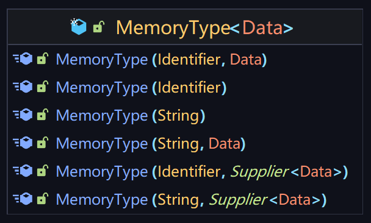

# 第二章 记忆 - 实体的海马体

_**author: daoge_cmd**_

## 1.0 记忆类型和记忆存储器

对于一个生物来说，不仅存在行为逻辑，在其生命周期中也具有一些实时数据。举个例子，对于羊来说，若其发现附近有手中拿着小麦的玩家并尝试移动过去，其“脑海”中就应该存储着对应此玩家的“记忆”。再比如说对于僵尸，其如果想要攻击最近的玩家，首先需要向“脑海”写入对应此玩家的记忆。这样子寻路器，攻击执行器，控制器等组件才能根据数据正常工作并实现目标行为

我们称上述的每个“数据”为一个记忆类型```MemoryType```。其中羊对应的记忆就是```NEAREST_FEEDING_PLAYER```（最近喂食玩家），僵尸对应的就是```ATTACK_TARGET```（仇恨目标）

"脑海"即记忆存储器```MemoryStorage```，其的概念比较好理解，每个实例化实体都拥有一个独立的记忆存储器，实体的所有记忆都保存在记忆存储器里面

### 1.0.1 创建一个新的记忆类型

MemoryType的可用构造函数如下: 



想要新建一个记忆，我们需要提供一个命名空间标识符```Identifier```以及记忆默认值（当尝试从存储器获取不存在的记忆的值时会返回默认值，可以是常量，也可以通过提供```Supplier<Data>```动态生成）

命名空间标识符是每个记忆类型的“身份证”。PNX核心内部使用的命名空间是```minecraft:```，若你想在插件中增加新的记忆类型，请使用不同于```minecraft:```的命名空间避免重复

核心使用到的所有记忆类型保存在接口```cn.nukkit.entity.ai.memory.CoreMemoryTypes```

## 1.1.0 通用性

对于不同实体使用到的含义相同的属性（例如仇恨目标），我们应尽量让他们使用相同的记忆类型。这样子，如果我们想让僵尸去攻击苦力怕，我们就可以将他们的”仇恨目标“分别设置为对方。

### 1.1.1 连接不同组件

事实上，记忆存储器不仅为行为提供信息，它还在组件间发挥了桥梁作用。例如默认的几个运动控制器就通过读取```MOVE_DIRECTION_START```、```MOVE_DIRECTION_END```等记忆移动实体，寻路器通过读取```MOVE_TARGET```计算路径。

通过记忆存储器，不同的简单组件被无缝衔接到了一起，实现了实体的复杂行为

## 1.2.0 作为属性保存还是作为记忆保存？

对于实体的数据（生命值，攻击伤害，仇恨目标，愤怒状态等），你可以选择将其作为属性直接保存在实体类上，并用接口抽象它的```getter/setter```。你也可以选择将其作为memory保存在实体记忆中。那是不是应该将所有数据都保存进memory呢？

看完上述内容，你也许会认为应该都存入到memory中，然而这样并不一定好。

对于**实体基础属性**，例如血量，生命值，攻击伤害等，我们规定应将其保存为实体类的属性并使用接口抽象

对于**实体运行时属性**，例如warden的愤怒值，实体寻路目标，仇恨目标等，我们规定应将其保存进memory

若你依然无法正确区分，我们还有个简单的判断方法，即观察属性是否应在实体生命周期结束（简单说就是close()掉了）后被保存。若应被保存，你就应该将其保存为实体类的属性而不是memory


